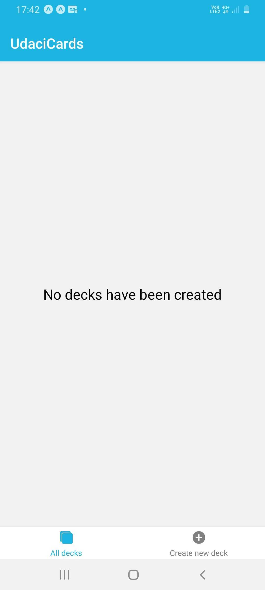
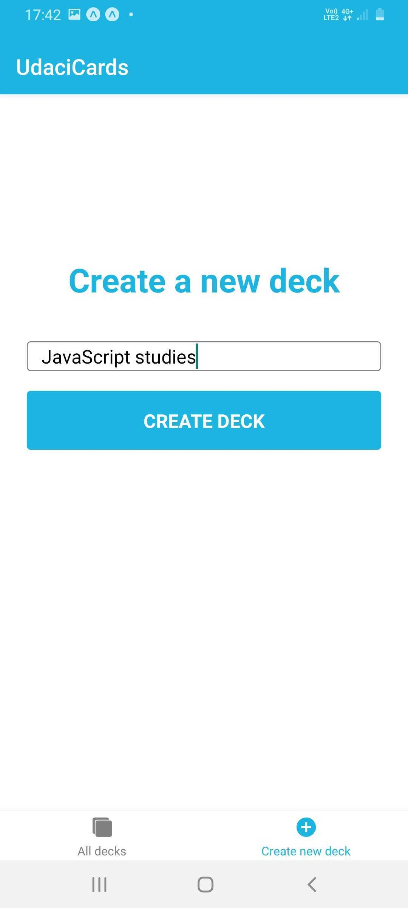
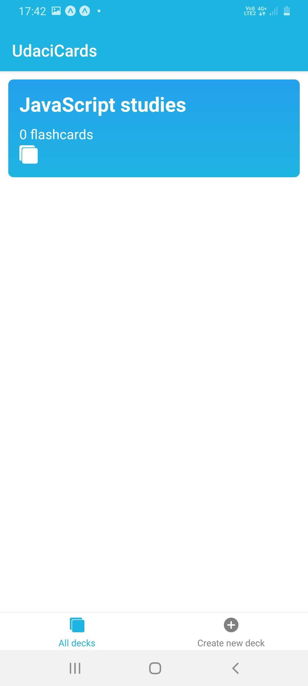
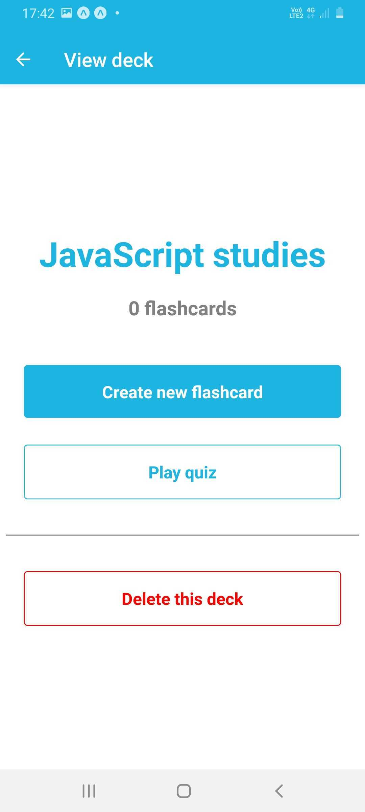
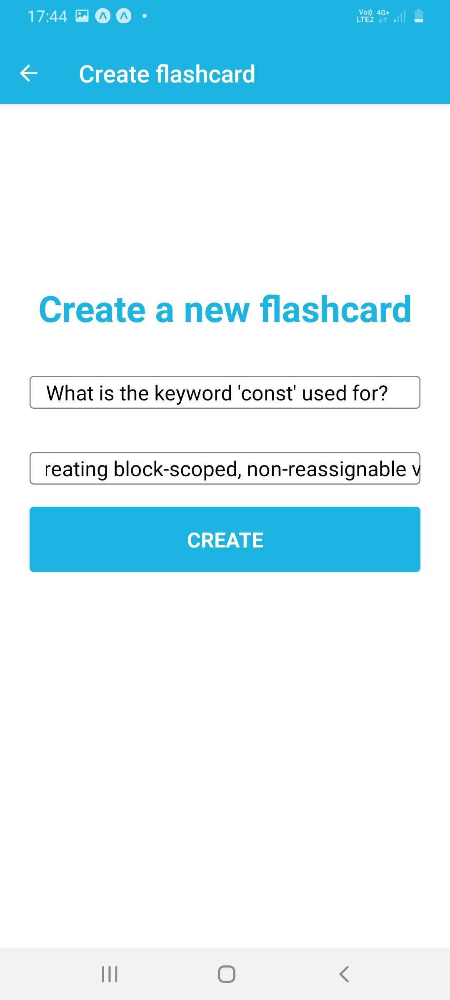
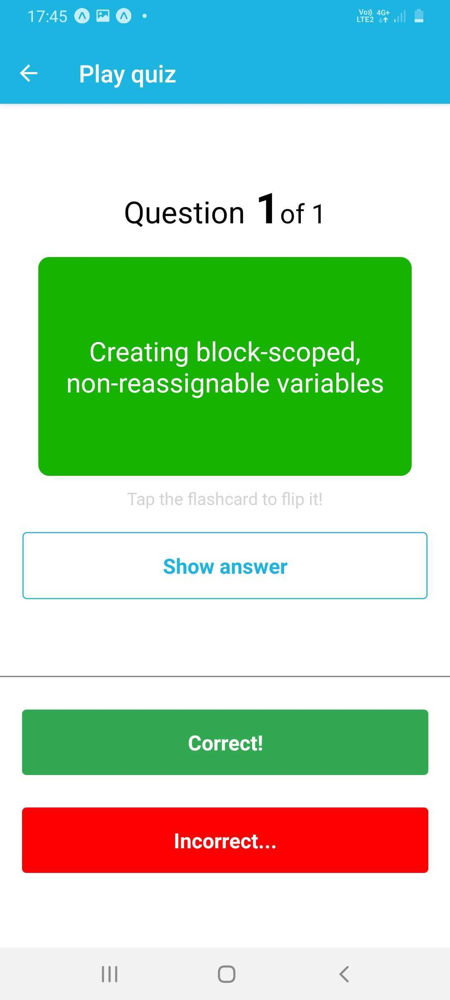

# UdaciCards
### Udacity Nanodegree Project

UdaciCards is the 3rd and final course project of Udacity's [React Nanodegree program](https://eu.udacity.com/course/react-nanodegree--nd019), written in React Native and Redux.

Based on the typical study methodology involving flashcards, this project involves the user creating decks of flashcards on different topics, and quizzing themselves on the various decks, by trying to recite the answer on the back of each flashcard, the answer to the respective question on the front of the flashcard.

Once an answer has been guessed, users can flip the card by tapping it, and appraise their answer as "Correct" or "Incorrect". At the end of the quiz they see the percentage of answers they got correct, where they then have the option to play the quiz again.

UdaciCards was built and appraised by official Udacity reviewers in line with Udacity's [rubric specifications](https://review.udacity.com/#!/rubrics/1021/view).

#### Running application
- `yarn` to install package dependencies from package.json
- `yarn expo` to run Expo on port 19001

#### Coding style & conventions
This project uses [ESLint](https://eslint.org/), and [Prettier](https://prettier.io/).
The style config files have been trialed and tested so sticking to them makes for great conventions and best practices throughout the code.

For IDEs like WebStorm and PyCharm, you can go to `Preferences | Tools | File Watchers` and add automatic watchers for ESLint and Prettier on any files you choose. Upon pressing save the watchers will auto-lint your changes for ease of use.

#### Project tech stack:
- This project was built using the Expo app and Android Studio for emulation, while being tested on a physical Samsung Galaxy A70 (Android OS) smartphone, running [API version 29, Android version 10 (Q)](https://developer.android.com/studio/releases/platforms#10) 
---
- [React Native](https://facebook.github.io/react-native/):
A JavaScript library for building native mobile apps using JavaScript and React
- [Redux](https://redux.js.org/):
State management tool for single page applications.
- [ESLint](https://eslint.org/):
Linting tool JavaScript
- [Prettier](https://prettier.io/):
Opinionated reformatting tool JavaScript

#### Screenshots
**No decks created**

**Creating a new deck**

**One deck created**

**Deck with no flashcards**

**Creating a new flashcard**

**Deck with one flashcard**

**Playing quiz- flashcard question**

**Playing quiz- flashcard answer**

**Quiz outcome- using extra flashcards**

#### Acknowledgements
- God and the Lord Jesus Christ, for helping me through this project! ❤️ ❤️ ❤️
- Team Udacity, for all their hard work in building great nanodegrees for great students of all walks of life
